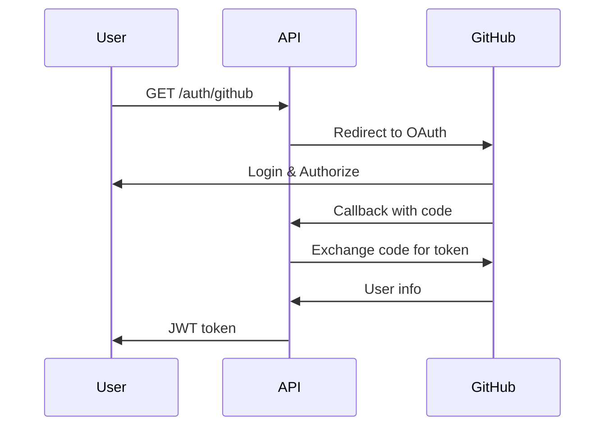

# 📝 Go Todo API

> A modern Todo API built with Go, featuring GitHub OAuth authentication, JWT tokens, and interactive Swagger documentation.

[](https://golang.org/)
[](https://www.docker.com/)
[](https://www.postgresql.org/)
[](https://swagger.io/)

## ✨ Features

- 🔐 **GitHub OAuth Authentication** - Secure login with GitHub accounts
- 🎯 **JWT Token Management** - Stateless authentication
- 📚 **Interactive API Documentation** - Swagger UI included
- 🐳 **Docker Ready** - Easy deployment with Docker Compose
- 🔒 **Protected Routes** - Middleware-based authentication
- 🎨 **CORS Support** - Frontend integration ready
- 📊 **PostgreSQL Database** - Reliable data persistence

## 🚀 Quick Start

### Prerequisites

- Go 1.21+
- Docker & Docker Compose
- GitHub OAuth App (for authentication)

### 1. Clone the repository

```bash
git clone https://github.com/yourusername/go-todo-api.git
cd go-todo-api
```

### 2. Create GitHub OAuth App

1. Go to [GitHub Developer Settings](https://github.com/settings/developers)
2. Create a new OAuth App
3. Set Authorization callback URL: `http://localhost:8080/auth/github/callback`

### 3. Environment Setup

Create `.env` file:

```env
GITHUB_CLIENT_ID=your_github_client_id
GITHUB_CLIENT_SECRET=your_github_client_secret
JWT_SECRET=your_super_secret_jwt_key
```

### 4. Run with Docker

```bash
docker-compose up --build
```

### 5. Access the API

- **API Base URL**: `http://localhost:8080`
- **Swagger Documentation**: `http://localhost:8080/swagger/index.html`

## 📖 API Documentation

### Authentication Flow



### Endpoints

| Method | Endpoint | Description | Auth |
|--------|----------|-------------|------|
| `GET` | `/auth/github` | Start GitHub OAuth flow | ❌ |
| `GET` | `/auth/github/callback` | Handle OAuth callback | ❌ |
| `GET` | `/api/me` | Get current user info | ✅ |
| `GET` | `/api/todos` | Get all user todos | ✅ |
| `POST` | `/api/todos` | Create new todo | ✅ |
| `GET` | `/api/todos/{id}` | Get specific todo | ✅ |
| `PATCH` | `/api/todos/{id}` | Update todo | ✅ |
| `DELETE` | `/api/todos/{id}` | Delete todo | ✅ |

### Example Usage

#### 1. Authenticate with GitHub
```bash
curl -X GET "http://localhost:8080/auth/github"
```

#### 2. Create a Todo
```bash
curl -X POST "http://localhost:8080/api/todos" \
  -H "Authorization: Bearer YOUR_JWT_TOKEN" \
  -H "Content-Type: application/json" \
  -d '{
    "title": "Learn Go",
    "completed": false
  }'
```

#### 3. Get All Todos
```bash
curl -X GET "http://localhost:8080/api/todos" \
  -H "Authorization: Bearer YOUR_JWT_TOKEN"
```

## 🏗️ Project Structure

```
go-todo-api/
├── 📄 main.go           # Application entry point
├── 🔐 auth.go           # GitHub OAuth handlers
├── 🛡️ middleware.go     # JWT authentication middleware
├── 🎯 handlers.go       # Todo CRUD handlers
├── 👤 user.go           # User-related handlers
├── 📊 todo.go           # Todo model
├── 🗄️ db.go             # Database connection
├── 📚 models.go         # Swagger documentation models
├── 🐳 docker-compose.yml
├── 📋 Dockerfile
└── 📖 docs/             # Auto-generated Swagger docs
```

## 🛠️ Technology Stack

| Component | Technology |
|-----------|------------|
| **Language** | Go 1.21+ |
| **Framework** | Gin Web Framework |
| **Database** | PostgreSQL with GORM |
| **Authentication** | GitHub OAuth + JWT |
| **Documentation** | Swagger/OpenAPI |
| **Containerization** | Docker & Docker Compose |

## 🧪 Development

### Local Development Setup

```bash
# Install dependencies
go mod tidy

# Generate Swagger docs
swag init

# Run the application
go run .
```

### Database Migrations

The application automatically creates tables using GORM auto-migration:
- `users` table for GitHub authenticated users
- `todos` table with foreign key to users

### Adding New Features

1. Add new routes in `main.go`
2. Implement handlers in appropriate files
3. Add Swagger documentation comments
4. Regenerate docs with `swag init`

## 🔧 Configuration

### Environment Variables

| Variable | Description | Required | Default |
|----------|-------------|----------|---------|
| `GITHUB_CLIENT_ID` | GitHub OAuth App ID | ✅ | - |
| `GITHUB_CLIENT_SECRET` | GitHub OAuth App Secret | ✅ | - |
| `JWT_SECRET` | JWT signing secret | ✅ | - |
| `PORT` | Server port | ❌ | 8080 |

### Docker Configuration

The project includes a complete Docker setup:
- **App container**: Go application
- **DB container**: PostgreSQL database
- **Health checks**: Ensures proper startup order

## 🎯 Frontend Integration

This API is designed to work with modern frontend frameworks:

### React Example
```javascript
const API_BASE = 'http://localhost:8080';

// Login with GitHub
window.location.href = `${API_BASE}/auth/github`;

// API calls with JWT
const fetchTodos = async () => {
  const token = localStorage.getItem('jwt_token');
  const response = await fetch(`${API_BASE}/api/todos`, {
    headers: {
      'Authorization': `Bearer ${token}`
    }
  });
  return response.json();
};
```

### CORS Support

Pre-configured CORS settings allow requests from:
- `http://localhost:3000` (React)
- `http://localhost:5173` (Vite)
- `http://localhost:8080` (Same origin)

## 🚀 Deployment

### Production Deployment

1. **Environment**: Set production environment variables
2. **Database**: Use managed PostgreSQL (AWS RDS, etc.)
3. **Domain**: Update GitHub OAuth callback URL
4. **SSL**: Enable HTTPS for production

### Docker Production

```bash
# Build for production
docker-compose -f docker-compose.prod.yml up --build
```

## 🤝 Contributing

1. Fork the repository
2. Create a feature branch (`git checkout -b feature/amazing-feature`)
3. Commit your changes (`git commit -m 'Add amazing feature'`)
4. Push to the branch (`git push origin feature/amazing-feature`)
5. Open a Pull Request

## 📄 License

This project is licensed under the MIT License - see the [LICENSE](LICENSE) file for details.

## 🙏 Acknowledgments

- [Gin Web Framework](https://gin-gonic.com/) - HTTP web framework
- [GORM](https://gorm.io/) - ORM library for Go
- [Swaggo](https://github.com/swaggo/swag) - Swagger documentation
- [GitHub OAuth](https://docs.github.com/en/developers/apps/oauth-apps) - Authentication provider

---

<p align="center">
  Made with ❤️ and Go
</p>

<p align="center">
  <a href="http://localhost:8080/swagger/index.html">📚 View API Documentation</a>
</p>